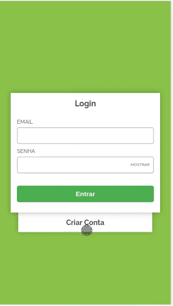

[](https://travis-ci.org/FidelisClayton/mini-wallet)

<p align="center">
  
</p>

# MiniWallet
MiniWallet is your new virtual wallet which offers a list of currencies, such as: Bitcoin, Brazilian Real, and Brita.

<p align="center">
  
</p>

## Features
- :arrow_up: Sell coins
- :arrow_down: Buy coins
- :book: See transactions history

## Stack
This app was build with ReactJS using `create-react-app`. The data is stored locally using PouchDB.

- [React](https://github.com/facebook/react/)
- [Redux](https://github.com/reduxjs/redux)
- [React Redux](https://github.com/reduxjs/react-redux)
- [PouchDB](https://github.com/pouchdb/pouchdb)
- [Emotion](https://github.com/emotion-js/emotion)

### Tests
This project uses [Jest](https://github.com/facebook/jest) and [Enzyme](https://github.com/airbnb/enzyme) to run the unit tests.

## Gettings started
To run this project locally you need to have NodeJS and NPM installed in your machine. After this, follow these steps:

1. Clone the repository:
```
git clone git@github.com:FidelisClayton/mini-wallet.git
```

2. Change to the project directory
```
cd mini-wallet
```

3. Install the dependencies
```
npm install
```

4. Serve the project
```
npm start
```

## Useful commands
- `npm run test`: to run the unit tests
- `npm run coverage`: to run the coverage tests
- `npm run build`: to make the production build

## :pencil: TODO
- [ ] Add unit tests to reducers
- [ ] Add unit tests to actions
- [ ] Add unit tests to database functions
- [ ] Add unit tests to helpers
